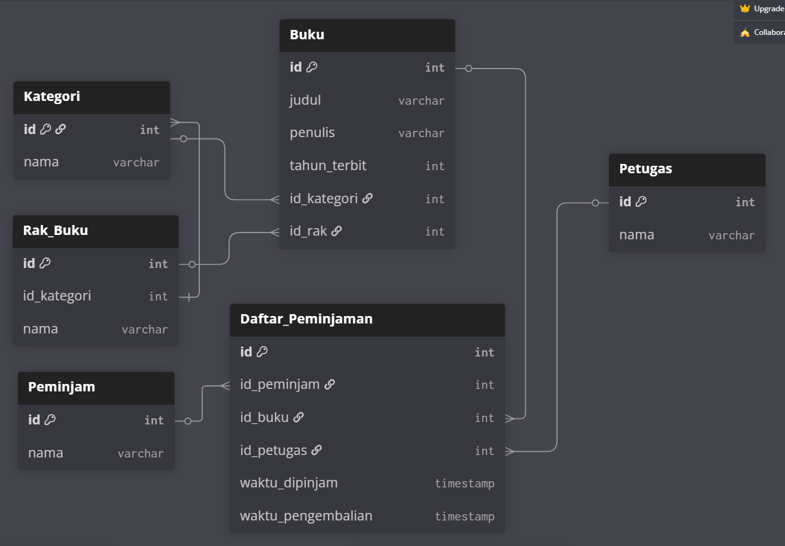

# ERD SYSTEM PERPUSTAKAAN
## [dbdiagram.io](https://dbdiagram.io/d/System-Perpustakaan-68ad5b0c1e7a61196799bc42)
```
Table Kategori {
  id int [pk]
  nama varchar
}

Table Rak_Buku {
  id int [pk]
  id_kategori int [ref: < Kategori.id]
  nama varchar
}

Table Buku {
  id int [pk]
  judul varchar
  penulis varchar
  tahun_terbit int
  id_kategori int [ref: > Kategori.id]
  id_rak int [ref: > Rak_Buku.id]
}

Table Petugas {
  id int [pk]
  nama varchar
}

Table Peminjam {
  id int [pk]
  nama varchar
}

Table Daftar_Peminjaman {
  id int [pk]
  id_peminjam int [ref: > Peminjam.id]
  id_buku int [ref: > Buku.id]
  id_petugas int [ref: > Petugas.id]
  waktu_dipinjam timestamp
  waktu_pengembalian timestamp
}

```

## Preview


___

## QUERY FROM DBEAVER
```
CREATE TABLE Kategori (
    id INT PRIMARY KEY,
    nama VARCHAR NOT NULL
);

CREATE TABLE Rak_Buku (
    id INT PRIMARY KEY,
    id_kategori INT NOT NULL,
    nama VARCHAR NOT NULL
);

CREATE TABLE Buku (
    id INT PRIMARY KEY,
    judul VARCHAR NOT NULL,
    penulis VARCHAR NOT NULL,
    tahun_terbit INT,
    id_kategori INT NOT NULL,
    id_rak INT NOT NULL
);

CREATE TABLE Petugas (
    id INT PRIMARY KEY,
    nama VARCHAR NOT NULL
);

CREATE TABLE Peminjam (
    id INT PRIMARY KEY,
    nama VARCHAR NOT NULL
);

CREATE TABLE Daftar_Peminjaman (
    id INT PRIMARY KEY,
    id_peminjam INT NOT NULL,
    id_buku INT NOT NULL,
    id_petugas INT NOT NULL,
    waktu_dipinjam TIMESTAMP,
    waktu_pengembalian TIMESTAMP NULL
);

alter table rak_buku add foreign key (id_kategori) references kategori(id);
alter table buku add foreign key (id_kategori) references kategori(id);
alter table buku add foreign key (id_rak) references rak_buku(id);
alter table daftar_peminjaman  add foreign key (id_peminjam) references peminjam(id);
alter table daftar_peminjaman  add foreign key (id_petugas) references petugas(id);
alter table daftar_peminjaman  add foreign key (id_buku) references buku(id);

INSERT INTO Kategori (id, nama) VALUES
(1,'Fiksi'),
(2, 'Non-Fiksi'),
(3, 'Sains'),
(4, 'Sejarah'),
(5, 'Teknologi'),
(6, 'Pemrograman'),
(7, 'Bisnis'),
(8, 'Novel'),
(9, 'Pendidikan'),
(10, 'Agama');

INSERT INTO Rak_Buku (id, id_kategori, nama) VALUES
(1, 1, 'Rak Fiksi A'),
(2, 1, 'Rak Fiksi B'),
(3, 2, 'Rak Non-Fiksi A'),
(4, 3, 'Rak Sains'),
(5, 4, 'Rak Sejarah'),
(6, 5, 'Rak Teknologi'),
(7, 6, 'Rak Pemrograman'),
(8, 7, 'Rak Bisnis'),
(9, 8, 'Rak Novel'),
(10, 9, 'Rak Pendidikan');

INSERT INTO Buku (id, judul, penulis, tahun_terbit, id_kategori, id_rak) VALUES
(1,'Laskar Pelangi', 'Andrea Hirata', 2005, 8, 9),
(2,'Bumi Manusia', 'Pramoedya Ananta Toer', 1980, 8, 9),
(3,'Clean Code', 'Robert C. Martin', 2008, 6, 7),
(4,'The Pragmatic Programmer', 'Andrew Hunt', 1999, 6, 7),
(5,'Sejarah Indonesia Modern', 'M.C. Ricklefs', 2001, 4, 5),
(6,'Sapiens', 'Yuval Noah Harari', 2011, 3, 4),
(7,'The Lean Startup', 'Eric Ries', 2011, 7, 8),
(8,'Atomic Habits', 'James Clear', 2018, 2, 3),
(9,'The Innovators Dilemma', 'Clayton Christensen', 1997, 5, 6),
(10, 'Pemrograman Python', 'John Doe', 2020, 6, 7);

INSERT INTO Petugas (id, nama) VALUES
(1, 'Ahmad Sutisna'),
(2, 'Budi Santoso'),
(3, 'Citra Dewi'),
(4, 'Diana Putri'),
(5, 'Eko Prasetyo');

INSERT INTO peminjam (id, nama) VALUES 
(1,'Atang'),  
(2,'Brembo'),
(3,'Cecep'),
(4,'Dudung'),
(5,'Edy'),
(6,'Fatul'),
(7,'Gogon'),
(8,'Haryati'),
(9,'Ikam'),
(10, 'Jemblem'),
(11, 'Kiwil'),
(12, 'Lia');

INSERT INTO Daftar_Peminjaman (id, id_peminjam, id_buku, id_petugas, waktu_dipinjam, waktu_pengembalian) VALUES
(1, 1, 3, 1, '2025-08-15 10:30:00', '2025-08-20 15:45:00'),
(2, 2, 5, 2, '2025-08-16 14:20:00', NULL),
(3, 3, 1, 3, '2025-08-17 09:15:00', '2025-08-22 11:30:00'),
(4, 4, 7, 1, '2025-08-18 16:40:00', NULL),
(5, 5, 2, 4, '2025-08-19 13:25:00', '2025-08-24 10:15:00'),
(6, 6, 4, 2, '2025-08-20 11:10:00', NULL),
(7, 7, 6, 3, '2025-08-21 15:30:00', NULL),
(8, 8, 8, 5, '2025-08-22 09:45:00', '2025-08-27 14:20:00'),
(9, 9, 10, 4, '2025-08-23 14:15:00', NULL),
(10, 10, 9, 1, '2025-08-24 10:30:00', '2025-08-29 16:45:00'),
(11, 4, 4, 2, '2025-08-25 11:10:00', NULL),
(12, 8, 6, 3, '2025-08-26 15:30:00', NULL),
(13, 12, 8, 5, '2025-08-27 09:45:00', '2025-08-27 14:20:00'),
(14, 11, 10, 4, '2025-08-28 14:15:00', NULL);
```